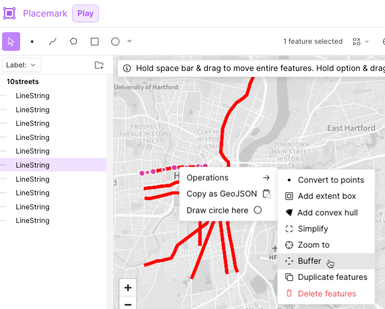
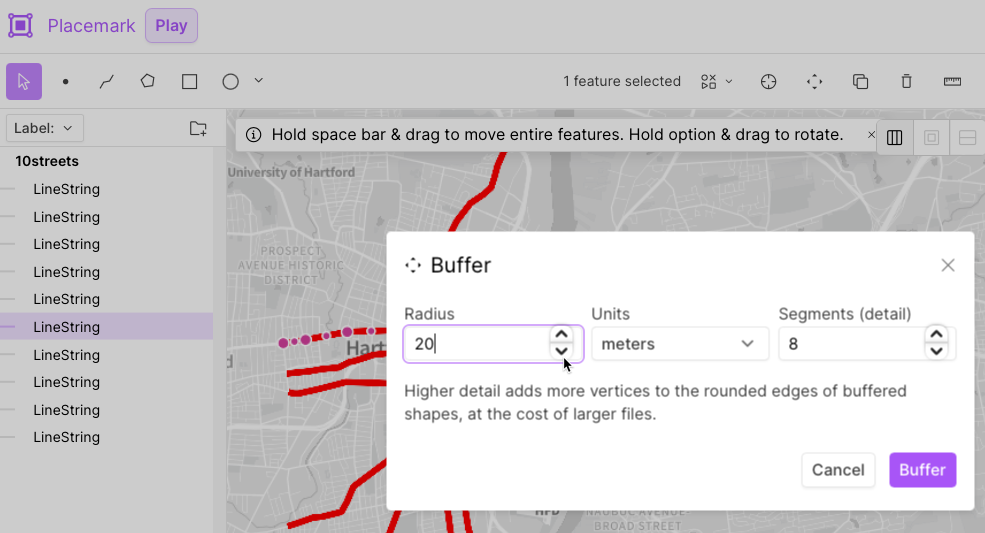
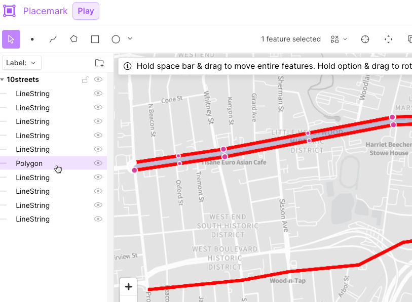
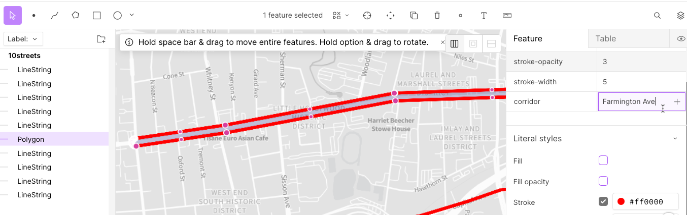
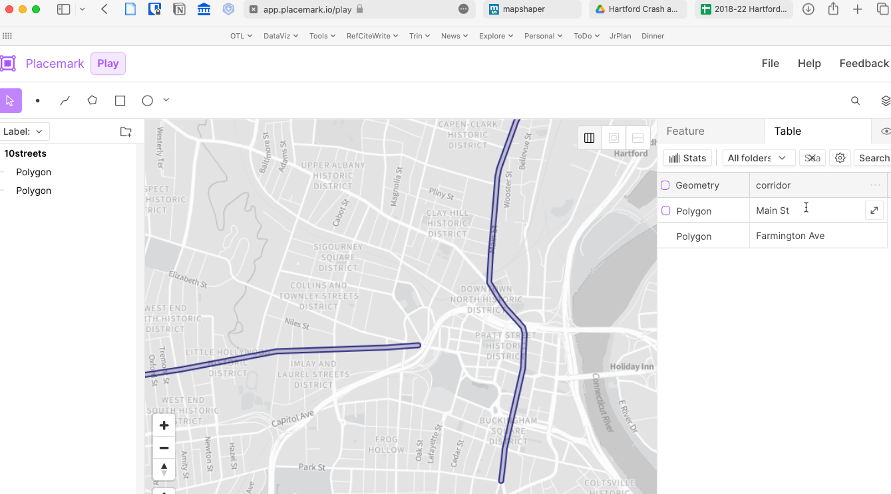
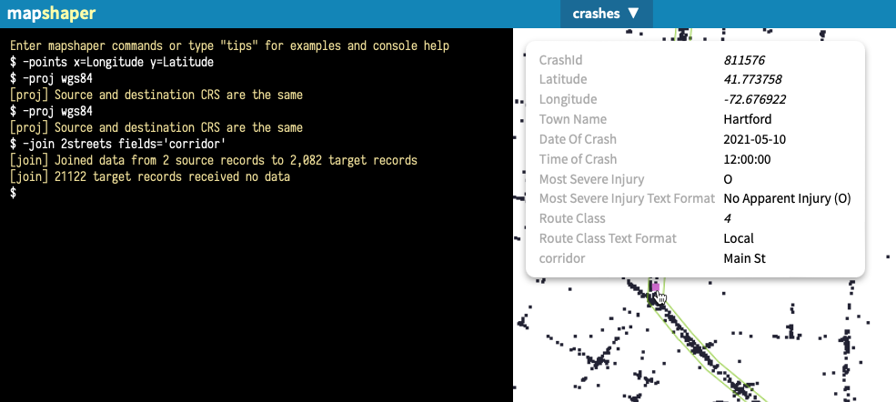
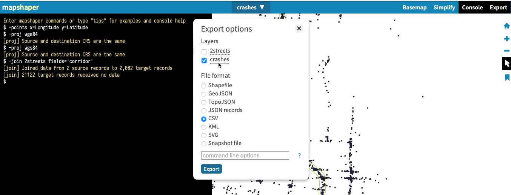

# hartford-crash-for-isaac-chris
suggestions for Isaac and Chris

## Overview
The goal is to create *polygons* (not lines) for areas around major street, so that you can capture (or "join") the crash points that occur inside those polygons. The result will be a spreadsheet (CSV) of *crashes joined with polygons* that displays a new column named *corridor*, which includes the name of each major street that you added as a polygon. Using a pivot table, you can view how many crashes occurred in each major street (if you added them as polygons above).

This repo contains files you sent me, plus new ones I created following the suggested steps below. You can view each by clicking on the file name inside GitHub in your browser, or go to Code > Download as Zip to work with them using other tools.

## Suggested steps
1. You sent me two files (10streets.geojson and hartford.geojson) which I placed in this repo. When I placed 10streets inside https://placemark.io (click *use for free*), I see it is only lines that made to appear to be very thick. But these are not polygons.

2. Fortunately, you can use the https://placemark.io tool to *buffer* objects, which converts lines into polygons. (This is less precise than hand-drawing each polygon, but it's definitely faster.) I buffered by clicking on a line (Farmington Ave), then right-click to Operations > Buffer. Next, I need to set the width of the buffer around the line to convert it into a polygon, and I arbitrarily chose 20 meters (you may choose differently). Click the Buffer button.

3. Now see how your *line* is now a *polygon*, and is labeled correctly in the table of contents, too.

4. Now that we have a *polygon* to represent the street, the next step is to properly name for when we eventually *join* them to crash points. In the Placemark.io tool, see the right side Feature, where I created a new property named *corridor*, and inserted the value *Farmington Ave*.

5. Next I used the buffer tool to convert a second line to a polygon. On the right side, notice how I clicked from the Feature to the Table tab, which allows me to easily enter the value *Main St* and easily see all *corridor* values. Also, I deleted the unnecessary properties (line thickness, red color) to avoid confusion.

6. In the Placemark.io tool, I deleted the other 8 lines but kepts the 2 polygons. Then in File > Export, I downloaded the file and renamed it *2streets.geojson*.

7. Now start up https://Mapshaper.org to upload the crashes.csv (points) and the 2streets.geojson (polygons) in order to join them. See my more detailed instructions about joining at https://github.com/bikewesthartford/wh-crash-analysis

8. In the image below, see how I uploaded the crashes.csv (in this repo), then the 2streets.geojson (in this repo), then joined them. The tool describes how 2 source records (Farmington Ave and Main St) were joined to 2,082 crashes, while 21,122 received no data because they are not located inside any polygons. When I Inspect crashes with my cursor, notice how some of them now contain "Main St" or "Farmington Ave" in a new *corridor* field. Finally, notice how the polygon outlines appear in light green because I intentionally made them visible (by clicking the eyeball) in the Mapshaper 2streets layer.

9. In Mapshaper, go to Export and select only the *crashes* layer, to be exported as a CSV spreadsheeet. Rename the downloaded file to something like *crashes-joined.csv* because it now has more info than the original *crashes.csv* file. See the file with this name in this repo. Open it up and you'll see how you can create a pivot table to show the total number (and percent) of all crashes that happened inside your polygons named Farmington Ave and Main St.  

